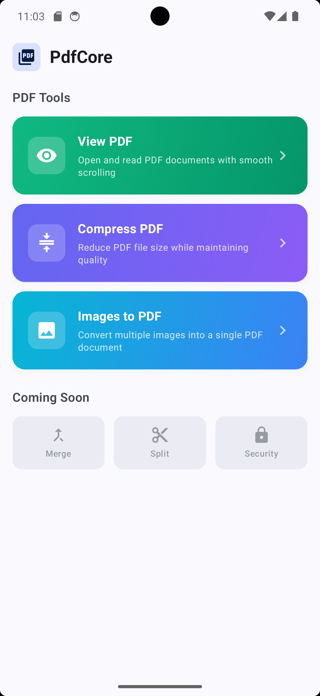
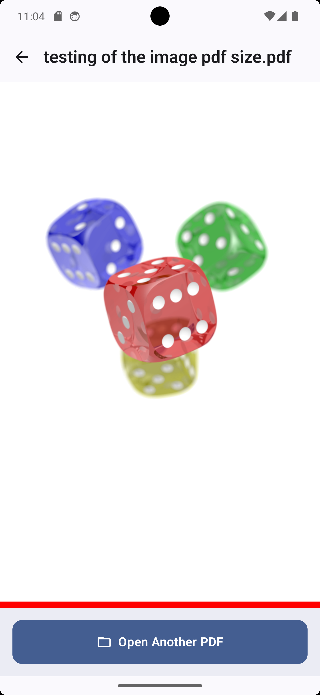
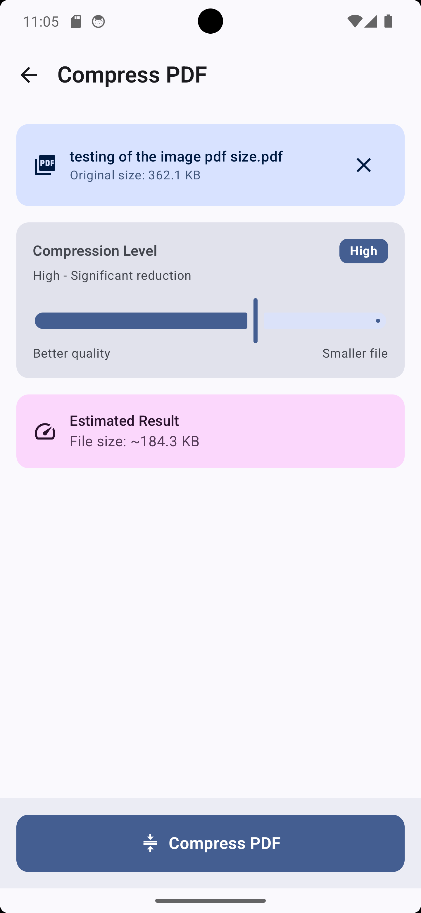
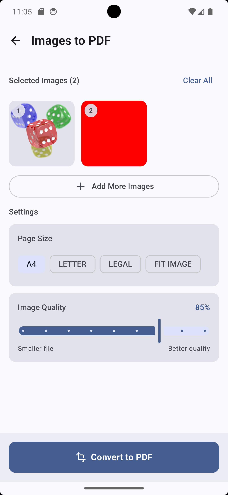

# PdfCore

**Developed by [@originalzerodev](https://github.com/originalzerodev)**

**PdfCore** is a lightning-fast, offline-first, and zero-permission Android utility application for managing, viewing, compressing, and converting PDF files. Built with a pristine Material 3 Jetpack Compose UI, PdfCore is engineered to respect user privacy and device storage.

---

## Download Latest APK

You can instantly download and install the latest stable APK directly from our GitHub Releases page—no Android Studio required!

👉 **[Download Latest PdfCore APK](https://github.com/originalzerodev/PdfCore_Project/releases/latest)**

---

## Key Features

* **Core PDF Viewer**: Deeply integrated native PDF viewer supporting high-performance tiled rendering and deep zooming via `SubsamplingScaleImageView`.
* **Smart PDF Compressor**: Multi-tier compression engine utilizing direct image optimization and full engine re-rendering (`PdfBox-Android`) to shrink PDFs by up to 90% without losing structural integrity.
* **Images to PDF Converter**: Instantly merge multiple photos/images into a clean, paginated PDF document with a sleek Compose 3-column image selection grid.
* **100% Offline & Zero-Permission**: No internet access required, no background analytics daemons, and zero invasive storage permissions needed (powered by Android's Storage Access Framework).
* **Ultra-Clean Cache Management**: Features a recursive startup cache sweeper and immediate on-dispose file purge, keeping app data footprints exceptionally low (~24 KB data / ~244 KB static cache upon reopening).

---

## Screenshots

| Home Screen | View PDF | Compress PDF | Images to PDF |
| :---: | :---: | :---: | :---: |
|  |  |  |  |

---

## Tech Stack & Architecture

* **Language**: Kotlin
* **UI Framework**: Jetpack Compose (Material 3)
* **Engines & Libraries**:
  * `PdfBox-Android` (Tom Roush) - Advanced PDF manipulation and compression.
  * `Coil` (Coil-kt) - Asynchronous image loading and memory buffering.
  * `pdfview-android` (Dmitry Borodin) - Native PDF rendering and decoding.
* **Build System**: Gradle (Kotlin DSL)

---

## Building & Running Locally

1. Clone the repository:
   ```bash
   git clone https://github.com/originalzerodev/PdfCore.git
   ```
2. Open the project in **Android Studio**.
3. Build and run on an emulator or physical device (Android 8.0+ supported, Android 11+ optimized).
4. To build a release or debug APK via terminal:
   ```bash
   ./gradlew assembleDebug
   ```

---

## Known Behaviors & Device Notes

During testing across different physical devices and Android OS versions, the following specific behaviors have been observed:

* **Xiaomi / Redmi Devices**: On devices such as the Redmi Note 10 Pro Max (Android 12), the installed application size may report as ~102 MB (not actual size) rather than the base ~29 MB APK size.
* **Older Android Versions (Pre-Android 13/14)**: On older Android versions, external file managers and system storage menus may initially display `0 B` for newly created image-based PDF files in external storage, even though the file opens and functions correctly inside the app itself.

---

## Future Roadmap

As part of our commitment to keeping PdfCore lightweight and fast, future development will focus on two major architectural milestones:

* **Modular Plugin System**: To avoid feature bloat, the core app will remain strictly dedicated to mandatory, essential features. Advanced capabilities will be introducible dynamically via isolated plugins.
* **Native C++ Engine Rewrite**: The entire underlying PDF parsing and compression engine will be rewritten in C++ (NDK/JNI) for maximum execution speed, zero JVM garbage collection overhead, and even lower memory/storage footprints.

---

## Open Source License & Attribution

This project is licensed under the **GNU General Public License v3.0 (GPLv3)** - see the [LICENSE](LICENSE) file for details.

### Acknowledgements & Upstream Projects
PdfCore incorporates, adapts, and modernizes open-source components from the following fantastic projects:
* **`Images-to-PDF`**: Core conversion architecture and UI layouts (GPLv3).
* **`pdfview-android`** by Dmitry Borodin: Native PDF tile rendering engine (Apache License 2.0).
* **`Pdf_Tools`**: Utility helper structures (Apache License 2.0).
* **`PdfBox-Android`** by Tom Roush: PDF document parsing engine (Apache License 2.0).
* **`Coil`**: Image loading library (Apache License 2.0).

*All Apache 2.0 components maintain their original notices and are utilized in full compliance with FSF license compatibility guidelines.*
